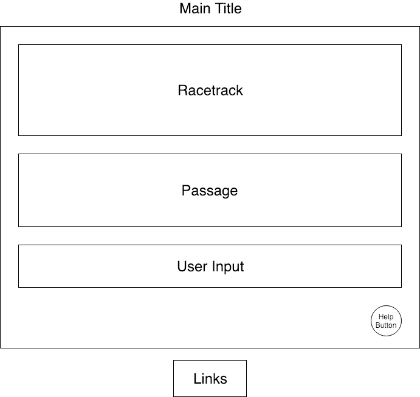

# ClackRacer

### Background

ClackRacer is typing gaming inspired by the multiplayer browser game TypeRacer. The goal of the game is to type a short passage as quickly as possible. Players must fix any errors before continuing the race, so accuracy is required. At the end of each race, players will see their accuracy and typing speed (word per minute).

### Functionality & MVP

ClackRacer will allow users to:
- [X] Start a round
- [X] Type passages with visual indication of progress and correctness
- [X] View typing speed and accuracy at the end of a round
- [ ] Choose to replay the passage or play a new passage at the end of each round

Additionally, the game will include:
- [ ] A Help modal describing the rules
- [ ] A production README

### Wireframes
The app will consist of a single screen with a game board, title and links to the repo, my portfolio, and my LinkedIn. There will be help modal at the bottom of the game board. Users will click into the user input section to type the passage.

### Technologies

This project will be implemented with the following technologies:
- `JavaScript` for game logic
- `Canvas API` for rendering
- `Webpack` for bundling JavaScript files

The game will primarily be comprised of the following files:

`board.js`: This will handle game logic such as validating user input, calculating typing speed and accuracy.

`board_view.js`: This will handle processing user input and rendering the state of the game.

### Implementation Timeline

__Day 1__: Setup skeletons for `board` and `board_view` and get webpack up and running. Render sprites using Canvas and build out module to handle user input.
- Get webpack running
- Get user input working

__Day 2__: Work on parsing passages (figure out where/how to store these as well), rendering to the board and linked to user input.
- Complete basic interaction and rendering for the game
- Render board with game state

__Day 3__: Build out game logic to validate user input (i.e. mistyped letters) and calculate speed and accuracy. Work on stylzing board based on game state.
- Finalize game logic
- Begin work on styling

__Day 4__: Add local high scores (using cookies), build help modal and finalize styling.
- Polish styling
- Add any necessary elements to improve UI/UX

### Bonus features

Some features I hope to include:
- [ ] Add global high scores
- [ ] Add multiplayer
- [ ] Add sound effects
